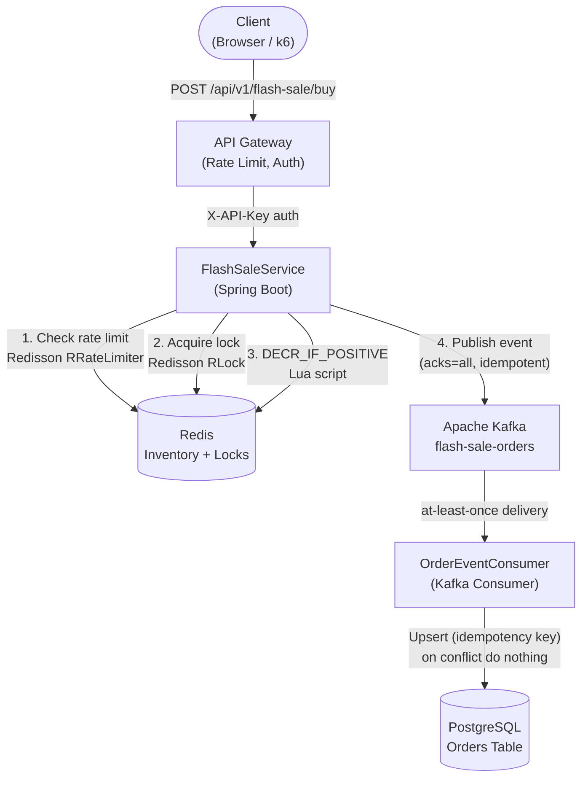

# Flash Sale System

A production-grade, event-driven backend engineered for high-concurrency flash sales. Handles thousands of simultaneous purchase requests with zero overselling, idempotent order processing, and full observability — the kind of system that runs Black Friday drops, sneaker releases, and concert ticket sales.

[](https://github.com/piush365/flashsale/actions/workflows/ci.yml)
[](https://adoptium.net/)
[](https://spring.io/projects/spring-boot)
[](LICENSE)

---

## The Problem

When thousands of users hit **Buy** at the same millisecond, a naïve implementation fails in two ways:

| Failure Mode | Root Cause | Consequence |
|---|---|---|
| **Overselling** | Non-atomic read-then-write on inventory | Selling items you don't have |
| **Database collapse** | Thundering herd on PostgreSQL | Deadlocks, cascading timeouts |

This project solves both — without sacrificing consistency, durability, or auditability.

---

## Architecture



### Order Flow (Happy Path)

```
Request
  │
  ├─ [Rate Limiter]  RRateLimiter.tryAcquire()    → 429 if exceeded
  │
  ├─ [Distributed Lock]  RLock.tryLock(1s wait)   → 409 if same user racing
  │
  ├─ [Atomic Decrement]  Lua: DECR_IF_POSITIVE     → 410 if stock == 0
  │
  ├─ [Kafka Publish]  kafkaTemplate.send().get()   → 500 + stock rollback on failure
  │                   Circuit breaker wraps this   → 503 if Kafka is degraded
  │
  └─ 202 Accepted
        │
        └─ [Kafka Consumer]  saveAndFlush()         → duplicate ignored via DB constraint
```

---

## Key Design Decisions

### 1. Redis Lua Script for Atomic Inventory Decrement

```lua
local val = redis.call('GET', KEYS[1])
if not val or tonumber(val) <= 0 then return -1 end
return redis.call('DECR', KEYS[1])
```

A single Redis command executes atomically on the server — no race between the check and the decrement. This is the core guarantee that prevents overselling at any scale.

**Why not just `DECR`?** DECR goes negative. You'd need a second command to restore, and you've already "sold" the item in the window between the two commands.

### 2. Idempotency Keys

Every accepted order carries a UUID `idempotencyKey`. The PostgreSQL schema enforces a `UNIQUE` constraint on this column. If Kafka redelivers a message (at-least-once semantics), the second `INSERT` raises a `DataIntegrityViolationException` that is caught and silently dropped — the order was already persisted.

This means the consumer is **exactly-once** from a business perspective, even though Kafka guarantees are at-least-once.

### 3. Resilience4j Circuit Breaker on Kafka

The Kafka send path is protected by a circuit breaker (`resilience4j.circuitbreaker.instances.kafka`). If Kafka becomes unavailable and 50% of calls fail over a 10-call sliding window, the circuit opens for 30 seconds. During that window:
- Orders fast-fail immediately with `503 Service Unavailable`
- Stock is **rolled back** in Redis (no phantom sold items)
- Threads are not blocked for the 5-second send timeout

### 4. Distributed Lock Scope

The `RLock` key is `lock:order:{userId}:{productId}`. This prevents the same user from placing two concurrent orders for the same product (common from double-tap or retry storms). Different users acquire independent locks — no cross-user contention.

### 5. Rate Limiter Correctness

The original code used `setRate()` which **resets the window** on every request. This was replaced with `trySetRate()` (idempotent — only configures if not yet initialized) plus `expire()` to refresh the TTL for active users. Idle users' keys auto-expire.

---

## Tech Stack

| Layer | Technology | Why |
|---|---|---|
| **Language** | Java 21 | Virtual threads ready, records, sealed types |
| **Framework** | Spring Boot 3.4 | Production autoconfiguration, Actuator, Validation |
| **Cache & Locks** | Redis + Redisson | Atomic Lua scripting, RRateLimiter, RLock |
| **Message Broker** | Apache Kafka | At-least-once delivery, replay, decoupling |
| **Database** | PostgreSQL + Flyway | ACID guarantees, versioned schema migrations |
| **Resilience** | Resilience4j | Circuit breaker protecting Kafka send path |
| **Security** | Spring Security | Stateless API-key auth, CSRF disabled |
| **Observability** | Micrometer + Prometheus + Grafana | Business metrics, p99 latency, custom dashboards |
| **API Docs** | SpringDoc OpenAPI | Swagger UI auto-generated from annotations |
| **Testing** | JUnit 5 + Mockito + Testcontainers | Unit, integration, concurrency tests |
| **Load Testing** | k6 | Ramp to 2,000 VUs, p95 < 200ms threshold |
| **Containers** | Docker + Docker Compose | One-command local environment |
| **CI/CD** | GitHub Actions | Build → unit tests → integration tests → Docker scan |

---

## API Reference

### POST `/api/v1/flash-sale/buy`

Place a flash-sale order for a product.

**Authentication:** `X-API-Key: <key>` header required.

**Request Parameters:**

| Parameter | Type | Required | Constraints |
|---|---|---|---|
| `userId` | string | yes | 1–64 chars, not blank |
| `productId` | string | yes | 1–64 chars, not blank |

**Response:**

| HTTP Status | Meaning | Scenario |
|---|---|---|
| `202 Accepted` | Order queued | Stock available, event published to Kafka |
| `400 Bad Request` | Validation failure | Blank userId/productId |
| `401 Unauthorized` | Auth failure | Missing or wrong `X-API-Key` |
| `409 Conflict` | Duplicate in-flight | Same user, same product, concurrent request |
| `410 Gone` | Sold out | Redis stock == 0 |
| `429 Too Many Requests` | Rate limited | > 3 requests/minute per user |
| `500 Internal Server Error` | Kafka failure | Event not published; stock rolled back |
| `503 Service Unavailable` | Circuit open | Kafka degraded; fast-fail with stock rollback |

**Response Body:**
```json
{
  "status": "ACCEPTED",
  "message": "Order queued for processing.",
  "correlationId": "f47ac10b-58cc-4372-a567-0e02b2c3d479",
  "timestamp": "2024-11-15T10:30:00Z"
}
```

Every response includes an `X-Correlation-Id` header that propagates through the entire request lifecycle (controller → service → Kafka → consumer → database log).

---

## Running Locally

### Prerequisites

- Docker and Docker Compose
- Java 21+ (for running without Docker)
- `API_KEY` environment variable (or use the default `dev-api-key-change-in-production`)

### One Command

```bash
docker compose up -d
```

This starts PostgreSQL, Redis, Kafka (with Zookeeper), the Spring Boot app, Prometheus, and Grafana — all wired together with health checks.

### Manual Start

```bash
# Start infrastructure only
docker compose up -d postgres redis kafka zookeeper

# Run the app
./mvnw spring-boot:run
```

### Access

| Service | URL | Credentials |
|---|---|---|
| Swagger UI | http://localhost:8080/swagger-ui/index.html | API Key: `dev-api-key-change-in-production` |
| Grafana Dashboard | http://localhost:3000 | admin / admin |
| Prometheus | http://localhost:9090 | — |
| Health Check | http://localhost:8080/actuator/health | — |

### Try It

```bash
# Place an order
curl -X POST "http://localhost:8080/api/v1/flash-sale/buy?userId=alice&productId=IPHONE15" \
     -H "X-API-Key: dev-api-key-change-in-production"

# Check stock level
docker compose exec redis redis-cli GET stock:product:IPHONE15

# Watch metrics
open http://localhost:3000
```

---

## Load Testing

```bash
# Install k6: https://k6.io/docs/getting-started/installation/
k6 run load-tests/flashsale.js
```

The script ramps to **2,000 virtual users** across 4 stages. Thresholds:
- `p(95) < 200ms` — 95th-percentile response time under 200ms
- `http_req_failed < 1%` — less than 1% of requests fail (500/503 errors)

---

## Testing

```bash
# Unit tests (fast, no external services)
./mvnw test -Dtest="!FlashSaleIntegrationTest"

# Integration tests (requires Docker for Testcontainers)
./mvnw verify

# Specific test class
./mvnw test -Dtest="OversellConcurrencyTest"
```

### Test Coverage

| Test | Type | What It Verifies |
|---|---|---|
| `FlashSaleServiceTest` | Unit | All 6 OrderResult paths: accepted, sold-out, rate-limited, concurrent-block, Kafka failure, lock release |
| `OversellConcurrencyTest` | Concurrency | 500 goroutines race to buy 100 items; accepted count ≤ 100 always |
| `FlashsaleApplicationTests` | Smoke | Spring context loads with all beans wired |
| `FlashSaleIntegrationTest` | Integration | Full HTTP → Redis → Kafka → PostgreSQL round-trip via Testcontainers |

---

## Observability

### Custom Metrics (Prometheus)

| Metric | Labels | Description |
|---|---|---|
| `flashsale_orders_total` | `result={accepted,sold_out,rate_limited,concurrent_block,circuit_open,error}` | Order outcomes |
| `flashsale_consumer_orders_total` | `status={saved,duplicate}` | Consumer persistence outcomes |
| `http_server_requests_seconds` | `uri,method,status` | Standard Spring Boot HTTP metrics |
| `resilience4j_circuitbreaker_state` | `name=kafka` | Circuit breaker state (0=CLOSED, 1=OPEN) |

### Grafana Dashboard

The provisioned dashboard (`grafana/provisioning/dashboards/flashsale.json`) includes:
- Order rate by result (accepted vs. sold-out vs. rate-limited)
- HTTP p99 latency
- JVM heap usage
- 5xx error rate
- Duplicate order detection rate
- Circuit breaker state

---

## Environment Variables

| Variable | Default | Description |
|---|---|---|
| `API_KEY` | `dev-api-key-change-in-production` | API authentication key |
| `DB_URL` | `jdbc:postgresql://localhost:5432/flashsaledb` | PostgreSQL JDBC URL |
| `DB_USERNAME` | `flashuser` | Database username |
| `DB_PASSWORD` | `flashpassword` | Database password |
| `REDIS_HOST` | `localhost` | Redis hostname |
| `REDIS_PORT` | `6379` | Redis port |
| `KAFKA_BOOTSTRAP_SERVERS` | `localhost:9092` | Kafka brokers |

---

## Distributed Systems Concepts Demonstrated

**Preventing Race Conditions at Scale**
The inventory decrement uses a Redis Lua script — a single atomic operation evaluated server-side. No two clients can interleave their check-then-decrement sequences because Lua scripts in Redis are guaranteed to execute without interruption.

**At-Least-Once Delivery + Idempotency = Effectively Exactly-Once**
Kafka's producer is configured with `acks=all` and `enable.idempotence=true`. The consumer handles redeliveries via a database-level unique constraint on `idempotency_key`. The combination means: every order event is delivered at least once, but only persisted exactly once.

**Backpressure and Fast Failure**
The Resilience4j circuit breaker acts as an automatic backpressure valve. Instead of letting slow Kafka calls pile up and exhaust the thread pool, the open circuit fast-fails immediately and rolls back the Redis decrement — keeping the system responsive under partial failure.

**Correlation IDs for Distributed Tracing**
Every request gets a UUID injected by `CorrelationIdFilter` into the SLF4J MDC. The ID appears in every log line for that request, in the response header (`X-Correlation-Id`), and in the response body. Upstream systems (or your eyes, while debugging) can trace a single order from HTTP → service → Kafka → consumer → database.

---

## Project Structure

```
src/main/java/com/example/flashsale/
├── api/                          # HTTP layer
│   ├── FlashSaleController.java  # POST /api/v1/flash-sale/buy
│   ├── GlobalExceptionHandler.java
│   └── dto/OrderResponse.java
├── application/                  # Use cases / orchestration
│   └── FlashSaleService.java     # Core order flow
├── domain/                       # Pure business types
│   ├── Order.java
│   ├── OrderEvent.java
│   ├── OrderRepository.java
│   └── OrderResult.java
└── infrastructure/               # External system adapters
    ├── config/                   # Spring configuration
    │   ├── FlashSaleProperties.java
    │   ├── InventoryConfig.java
    │   ├── KafkaConfig.java
    │   ├── RedissonConfig.java
    │   └── SecurityConfig.java
    ├── health/
    │   └── FlashSaleHealthIndicator.java
    ├── kafka/
    │   └── OrderEventConsumer.java
    ├── redis/
    │   ├── InventoryStore.java        # Port (interface)
    │   └── RedisInventoryStore.java   # Adapter (Redis Lua impl)
    ├── security/
    │   └── ApiKeyAuthFilter.java
    └── web/
        └── CorrelationIdFilter.java
```

---

## License

MIT — see [LICENSE](LICENSE).
