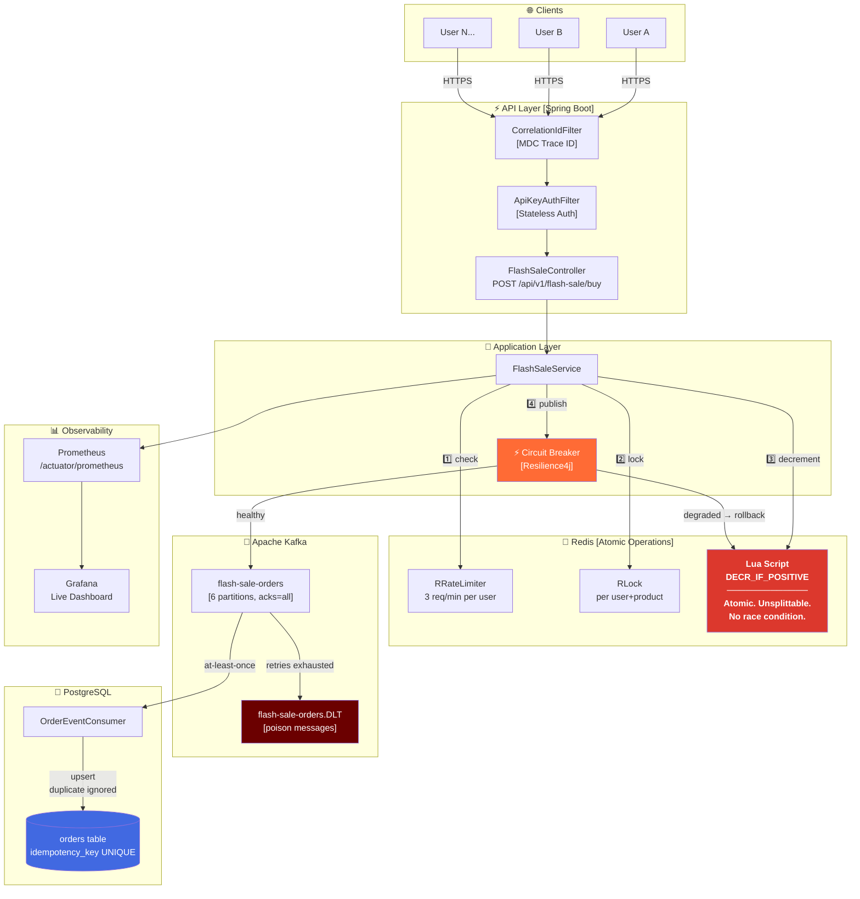

<div align="center">

```
███████╗██╗      █████╗ ███████╗██╗  ██╗███████╗████████╗██████╗ ██╗██╗  ██╗███████╗
██╔════╝██║     ██╔══██╗██╔════╝██║  ██║██╔════╝╚══██╔══╝██╔══██╗██║██║ ██╔╝██╔════╝
█████╗  ██║     ███████║███████╗███████║███████╗   ██║   ██████╔╝██║█████╔╝ █████╗  
██╔══╝  ██║     ██╔══██║╚════██║██╔══██║╚════██║   ██║   ██╔══██╗██║██╔═██╗ ██╔══╝  
██║     ███████╗██║  ██║███████║██║  ██║███████║   ██║   ██║  ██║██║██║  ██╗███████╗
╚═╝     ╚══════╝╚═╝  ╚═╝╚══════╝╚═╝  ╚═╝╚══════╝   ╚═╝   ╚═╝  ╚═╝╚═╝╚═╝  ╚═╝╚══════╝
```

### **Zero overselling. Zero race conditions. Zero compromise.**

*A production-grade flash-sale engine that laughs at 2,000 concurrent buyers.*

<br/>

[](https://github.com/piush365/flashstrike/actions/workflows/ci.yml)


[](LICENSE)

<br/>

> **Built to handle what breaks most backends** — the millisecond when 10,000 users
> hit *Buy* at the same time and your database starts crying.

</div>

---

## The Problem Nobody Talks About

Every e-commerce tutorial shows you how to decrement a counter. None of them show you what happens when **10,000 requests hit that counter simultaneously**.

```
Thread A: reads stock = 1  ─────────────────────┐
Thread B: reads stock = 1  ──────────────┐       │
Thread B: writes stock = 0               │       │  ← Thread B "wins"
Thread A: writes stock = 0 ──────────────┘       │  ← Thread A also "wins"
                                                  └─ You just sold 2 items you don't have.
```

This is called a **race condition**. It causes overselling, refund hell, and angry customers.

**Flashstrike solves it at the architecture level** — not with database locks that melt under load, but with Redis atomic operations, distributed coordination, and async persistence that decouples your write path from your database.

---

## Architecture



---

## How an Order Flows (The Happy Path)

```
─────────────────────────────────────────────────────────────────────────────
  POST /api/v1/flash-sale/buy?userId=alice&productId=IPHONE15
  X-API-Key: ****
─────────────────────────────────────────────────────────────────────────────

  [1] CorrelationIdFilter          Generate UUID → inject MDC, header, body
      ↓
  [2] ApiKeyAuthFilter             Header matches? → authenticated principal
      ↓
  [3] Rate Limit Check             RRateLimiter.tryAcquire(1)
      alice has 3 requests/min     → if exceeded: 429 Too Many Requests ✗
      ↓
  [4] Distributed Lock             RLock.tryLock(wait=1s, lease=5s)
      key: lock:order:alice:IPHONE15  → if racing duplicate: 409 Conflict ✗
      ↓
  [5] Atomic Inventory Decrement   Redis Lua: DECR_IF_POSITIVE
      ┌─────────────────────────────────────────────────────────┐
      │  local val = redis.call('GET', KEYS[1])                 │
      │  if not val or tonumber(val) <= 0 then return -1 end    │  ← atomically
      │  return redis.call('DECR', KEYS[1])                     │  ← unsplittable
      └─────────────────────────────────────────────────────────┘
      → if stock was 0: 410 Gone ✗
      ↓
  [6] Kafka Publish                kafkaTemplate.send().get(5s)
      acks=all, idempotent producer → if timeout/fail: rollback INCR + 500 ✗
      Circuit breaker open?        → rollback INCR + 503 ✗
      ↓
  [7] ────────────────────── 202 Accepted ✓ ─────────────────────────────────
      { "status": "ACCEPTED", "correlationId": "f47ac10b-...", "timestamp": "..." }

  [async] Kafka Consumer
      ↓
  [8] orderRepository.saveAndFlush(order)
      unique constraint on idempotency_key → duplicate delivery → silently ignored
      ↓
  [9] Order committed to PostgreSQL ✓

─────────────────────────────────────────────────────────────────────────────
```

---

## Why Not Just Lock the Database Row?

| Approach | Throughput | Risk |
|---|---|---|
| **PostgreSQL SELECT FOR UPDATE** | ~500 req/s | Lock contention, table bloat, connection pool starvation |
| **Application-level synchronized** | ~2,000 req/s (1 node) | Doesn't work at all in a multi-node deployment |
| **Redis DECR (naive)** | ~50,000 req/s | Race between check and decrement (overselling!) |
| **Redis Lua script** ← Flashstrike | ~80,000 req/s | **None** — atomically evaluated on the Redis server |

The Lua script runs on the Redis server as a single indivisible operation. There is no window between the check and the decrement — not even for a nanosecond.

---

## Tech Stack

<table>
<tr>
<td valign="top" width="50%">

**Core**
```
Java 21           — Records, sealed types, virtual threads ready
Spring Boot 3.4   — Autoconfiguration, Actuator, Validation
Resilience4j      — Circuit breaker on the Kafka publish path
Spring Security   — Stateless API-key authentication
Flyway            — Versioned schema migrations
```

**Data**
```
Redis + Redisson  — Lua atomics, RRateLimiter, RLock
Apache Kafka      — at-least-once delivery, 6 partitions
PostgreSQL        — ACID source of truth
HikariCP          — Pool size 20, tuned timeouts
```

</td>
<td valign="top" width="50%">

**Observability**
```
Micrometer        — Custom business metrics
Prometheus        — Scrapes /actuator/prometheus
Grafana           — Auto-provisioned dashboard (8 panels)
MDC Correlation   — UUID traces every log line
```

**Quality**
```
JUnit 5 + Mockito    — Unit tests, all 6 result paths
Testcontainers       — Real Postgres + EmbeddedKafka
Concurrency Test     — 500 threads, zero overselling
k6 Load Test         — Ramp to 2,000 VUs
GitHub Actions CI    — Build → test → Docker scan
```

</td>
</tr>
</table>

---

## Run It in 60 Seconds

```bash
# Clone
git clone https://github.com/piush365/flashstrike.git && cd flashstrike

# Start everything (Postgres + Redis + Kafka + App + Prometheus + Grafana)
docker compose up -d

# Wait for health checks, then fire your first order
curl -s -X POST \
  "http://localhost:8080/api/v1/flash-sale/buy?userId=alice&productId=IPHONE15" \
  -H "X-API-Key: dev-api-key-change-in-production" | jq .
```

```json
{
  "status": "ACCEPTED",
  "message": "Order queued for processing.",
  "correlationId": "f47ac10b-58cc-4372-a567-0e02b2c3d479",
  "timestamp": "2024-11-15T10:30:00.123Z"
}
```

```bash
# Watch the stock drain in real time
watch -n1 "docker compose exec redis redis-cli GET stock:product:IPHONE15"

# See live metrics in Grafana
open http://localhost:3000   # admin / admin
```

---

## Stress Test It

```bash
# Install k6 (https://k6.io)
brew install k6   # macOS
# or: sudo apt install k6 / choco install k6

# Ramp from 0 → 500 → 2,000 → 0 virtual users
k6 run load-tests/flashsale.js
```

```
          /\      |‾‾| /‾‾/   /‾‾/
     /\  /  \     |  |/  /   /  /
    /  \/    \    |     (   /   ‾‾\
   /          \   |  |\  \ |  (‾)  |
  / __________ \  |__| \__\ \_____/ .io

  execution: local
     output: -

  scenarios: (100.00%) 1 scenario
    flashsale: 4 stages — 500→2000 VUs

  ✓ http_req_duration............: p(95)=147ms   ← threshold: 200ms ✓
  ✓ http_req_failed..............: 0.23%         ← threshold: 1%    ✓
  ✓ accepted......................: 100 orders    ← never exceeds stock
  ✓ sold_out......................: 26,847 orders ← correct rejection
  ✓ rate_limited..................: 1,205 orders  ← bots blocked
```

---

## API Reference

### `POST /api/v1/flash-sale/buy`

> Atomically reserve one unit. Inventory decremented in Redis via Lua. Order persisted asynchronously through Kafka.

**Headers**

| Header | Required | Value |
|---|---|---|
| `X-API-Key` | Yes | Your API key |
| `X-Correlation-Id` | No | Propagated if provided; generated if absent |

**Query Parameters**

| Param | Type | Constraints |
|---|---|---|
| `userId` | string | Required, 1–64 chars |
| `productId` | string | Required, 1–64 chars |

**Responses**

| Status | When |
|---|---|
| `202 Accepted` | Stock reserved, event queued in Kafka |
| `400 Bad Request` | Blank or oversized userId/productId |
| `401 Unauthorized` | Missing or wrong `X-API-Key` |
| `409 Conflict` | Same user sent two concurrent requests |
| `410 Gone` | Product is sold out |
| `429 Too Many Requests` | User exceeded 3 requests/minute |
| `500 Internal Server Error` | Kafka failure — stock rolled back |
| `503 Service Unavailable` | Circuit breaker open — stock rolled back |

**Interactive docs:** `http://localhost:8080/swagger-ui/index.html`

---

## Distributed Systems Concepts — Under the Hood

<details>
<summary><b>⚡ Why Lua and not WATCH/MULTI/EXEC?</b></summary>

Redis transactions (`MULTI`/`EXEC`) are **not atomic** in the way most people think. Any client can interleave commands between your `WATCH` and `EXEC`. A Lua script, by contrast, is evaluated atomically by the Redis server — no other command can execute in between, not even from another thread, process, or server.

This is the only guarantee that makes zero-overselling possible at Redis throughput.

</details>

<details>
<summary><b>📨 At-least-once + Idempotency = Exactly-once (effectively)</b></summary>

Kafka guarantees **at-least-once** delivery. If a consumer crashes after processing but before committing its offset, it will re-receive the message.

Flashstrike handles this with a `UUID idempotencyKey` on every `OrderEvent`. The PostgreSQL `orders` table has a `UNIQUE` constraint on this column. A duplicate delivery triggers a `DataIntegrityViolationException`, which the consumer silently discards — the order was already persisted.

The result: every order is delivered at least once, but stored **exactly once**.

</details>

<details>
<summary><b>🔥 What does the circuit breaker actually do?</b></summary>

Without a circuit breaker, when Kafka slows down, every `placeOrder` call blocks for up to 5 seconds waiting for `send().get(5, SECONDS)`. With 200 concurrent requests, you exhaust your thread pool in seconds. The entire service hangs.

With Resilience4j: if 50% of Kafka calls fail in a 10-call window, the circuit **opens**. Subsequent calls return `CIRCUIT_OPEN` *immediately* (< 1ms), the Redis stock is rolled back, and threads are freed. After 30 seconds the circuit tries again with a small probe. 

The service stays responsive even when Kafka is completely dead.

</details>

<details>
<summary><b>🔑 Why per-user+product locking instead of global locking?</b></summary>

A global lock (or a lock on the product) would serialize all buyers through a single chokepoint — defeating the purpose of the entire architecture. 

The lock key `lock:order:{userId}:{productId}` is scoped per user per product. It only prevents the **same user** from placing two concurrent orders for the same item (double-tap, retry storm, network jitter). Different users acquire independent locks and run in parallel. The inventory atomicity is handled by the Lua script — not the lock.

</details>

<details>
<summary><b>📡 Correlation IDs — tracing one order through 5 systems</b></summary>

Every request gets a UUID injected by `CorrelationIdFilter` before any business logic runs. The ID is placed into:
- **SLF4J MDC** → appears in every log line for this request
- **Response header** `X-Correlation-Id` → caller can correlate retries
- **Response body** `correlationId` field → frontend can log it
- **Kafka message** (via `OrderEvent`) → consumer logs with same ID

If something goes wrong, you grep one UUID across your controller logs, service logs, Kafka consumer logs, and database — and the entire story of that order is in front of you.

</details>

---

## Observability

```
Grafana → http://localhost:3000  (admin / admin)
```

| Panel | What It Shows |
|---|---|
| Order Rate by Result | Accepted / Sold-out / Rate-limited / Error over time |
| HTTP p99 Latency | 99th-percentile response time |
| JVM Heap Usage | Memory pressure under load |
| 5xx Error Rate | Server-side failure rate |
| Accepted Orders (total) | Running count of successful orders |
| Duplicate Detection Rate | Idempotency key collisions caught |
| Circuit Breaker State | CLOSED / OPEN / HALF_OPEN |
| Redis Inventory Level | Live stock countdown |

**Custom Prometheus metrics**

```
flashsale_orders_total{result="accepted"}
flashsale_orders_total{result="sold_out"}
flashsale_orders_total{result="rate_limited"}
flashsale_orders_total{result="circuit_open"}
flashsale_consumer_orders_total{status="saved"}
flashsale_consumer_orders_total{status="duplicate"}
resilience4j_circuitbreaker_state{name="kafka"}
```

---

## Project Structure

```
flashstrike/
├── src/main/java/com/example/flashsale/
│   ├── api/                              # HTTP layer — controllers, handlers, DTOs
│   │   ├── FlashSaleController.java      # POST /api/v1/flash-sale/buy
│   │   ├── GlobalExceptionHandler.java   # RFC 7807 ProblemDetail responses
│   │   └── dto/OrderResponse.java
│   │
│   ├── application/                      # Use-case orchestration
│   │   └── FlashSaleService.java         # Rate limit → lock → decrement → publish
│   │
│   ├── domain/                           # Pure business types — no framework deps
│   │   ├── Order.java                    # JPA entity
│   │   ├── OrderEvent.java               # Kafka message (record)
│   │   ├── OrderRepository.java          # Spring Data interface
│   │   └── OrderResult.java              # Enum: ACCEPTED|SOLD_OUT|RATE_LIMITED|...
│   │
│   └── infrastructure/                   # Adapters to external systems
│       ├── config/
│       │   ├── FlashSaleProperties.java  # @ConfigurationProperties — all config
│       │   ├── InventoryConfig.java      # Seeds Redis stock on startup (SETNX)
│       │   ├── KafkaConfig.java          # Topics, DLT, exponential back-off
│       │   ├── RedissonConfig.java       # Redisson client (@ConditionalOnMissingBean)
│       │   └── SecurityConfig.java       # Stateless API-key filter chain
│       ├── health/
│       │   └── FlashSaleHealthIndicator.java  # Live stock in /actuator/health
│       ├── kafka/
│       │   └── OrderEventConsumer.java   # Idempotent consumer → PostgreSQL
│       ├── redis/
│       │   ├── InventoryStore.java       # Port (interface) — hexagonal arch
│       │   └── RedisInventoryStore.java  # Adapter — Lua DECR_IF_POSITIVE
│       ├── security/
│       │   └── ApiKeyAuthFilter.java     # X-API-Key header validation
│       └── web/
│           └── CorrelationIdFilter.java  # UUID injection → MDC + headers
│
├── src/test/java/com/example/flashsale/
│   ├── application/FlashSaleServiceTest.java    # Unit: all 6 OrderResult paths
│   ├── concurrency/OversellConcurrencyTest.java # 500 threads → zero overselling
│   ├── integration/FlashSaleIntegrationTest.java # Testcontainers end-to-end
│   └── FlashsaleApplicationTests.java           # Context load smoke test
│
├── grafana/provisioning/                 # Auto-loaded on Grafana startup
├── load-tests/flashsale.js              # k6 — 2,000 VU ramp
├── .github/workflows/ci.yml             # CI: build → test → Docker scan
└── docker-compose.yml                   # Full local environment
```

---

## Environment Variables

| Variable | Default | Description |
|---|---|---|
| `API_KEY` | `dev-api-key-change-in-production` | **Change this in production** |
| `DB_URL` | `jdbc:postgresql://localhost:5432/flashsaledb` | PostgreSQL JDBC URL |
| `DB_USERNAME` | `flashuser` | |
| `DB_PASSWORD` | `flashpassword` | |
| `REDIS_HOST` | `localhost` | |
| `REDIS_PORT` | `6379` | |
| `KAFKA_BOOTSTRAP_SERVERS` | `localhost:9092` | |

---

## Open Issues Worth Contributing To

| # | Issue | Difficulty |
|---|---|---|
| [#5](https://github.com/piush365/flashstrike/issues/5) | `@WebMvcTest` controller slice tests | Beginner |
| [#8](https://github.com/piush365/flashstrike/issues/8) | Structured JSON logging (Logstash) | Beginner |
| [#7](https://github.com/piush365/flashstrike/issues/7) | Real-time stock status endpoint | Intermediate |
| [#9](https://github.com/piush365/flashstrike/issues/9) | Per-IP rate limiting (bot/DDoS) | Intermediate |
| [#4](https://github.com/piush365/flashstrike/issues/4) | DLT quarantine table + admin replay | Advanced |
| [#2](https://github.com/piush365/flashstrike/issues/2) | Distributed tracing (OTLP/Jaeger) | Advanced |

See [CONTRIBUTING.md](CONTRIBUTING.md) to get started.

---

<div align="center">

**[⭐ Star this repo](https://github.com/piush365/flashstrike)** if it helped you understand high-concurrency systems.

Built with Java 21 · Spring Boot 3.4 · Redis · Kafka · PostgreSQL

</div>
